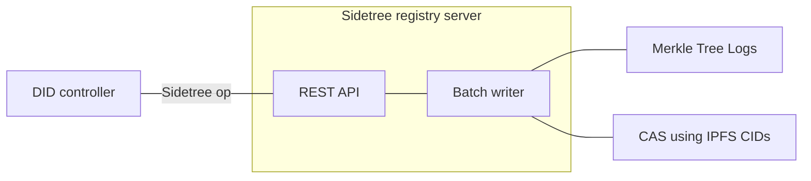
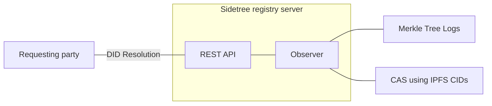
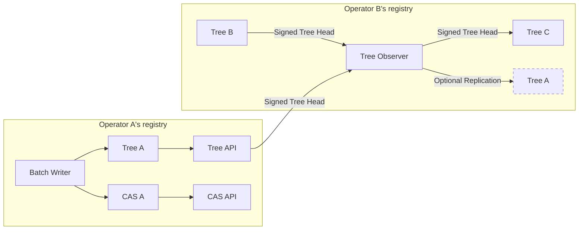
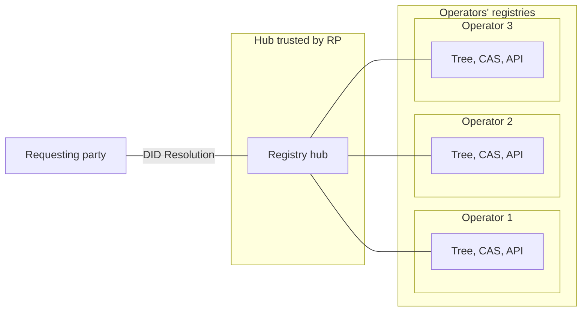
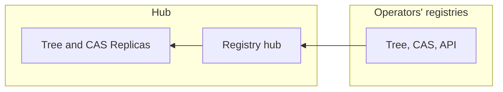
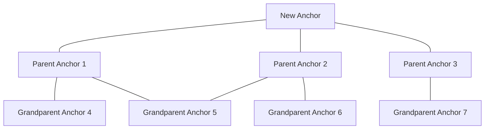
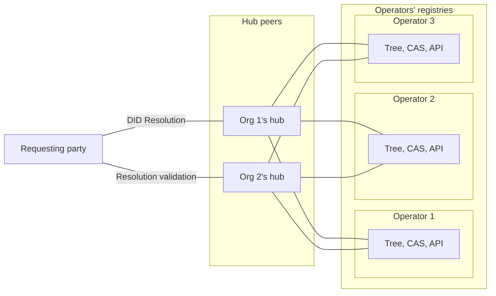

# Orbital: Federated Sidetree DID method

Status: concept whitepaper
Version: Dec 15, 2020
GitHub source: https://github.com/trustbloc/trustbloc-did-method/blob/master/docs/whitepaper/federated_sidetree.md

## Introduction

Orbital is a [decentralized identifier](https://www.w3.org/TR/did-core/) (DID) method that enables trusted DID verification over a federation of DID publishers. The method is loosely modelled on the concept of a [Fediverse](https://en.wikipedia.org/wiki/Fediverse), where an operator of a verifiable registry can start with their own instance, and also be able to interconnect with other verifiable registry operators over time. DID controllers may migrate their DIDs over different DID publishers over time. We also introduce the concept of a Registry Hub, where a group of DID observers/witnesses support resolution over multiple DID registry operators.

Orbital is designed to support interoperability across independent registries and be agnostic to implementation choices within these registries. Each independent operator can form their own "Orbital" registry and these registries can be interconnected. We use a data model that is independent of a protocol, database or DLT. In particular, we enable interconnected independent registries without up-front coordination nor a dependency on using the same registry implementation. These registries can independently form over time and then choose to interconnect.

The DID method name is `did:orb`. The orbital name is derived from the concept of an [Atomic orbital](https://en.wikipedia.org/wiki/Atomic_orbital) as an analogy to locating the interconnected and replicated registry data.

## History and motivation

The Orbital DID method is an evolution of the TrustBloc DID method. The [TrustBloc DID](https://github.com/trustbloc/trustbloc-did-method/blob/master/docs/spec/trustbloc-did-method.md) method had the goal of bringing together a group of independent parties, a consortium, to share custody of a DID registry. The [DIF Sidetree protocol](https://identity.foundation/sidetree/spec/) was leveraged to minimize the needed trust in the ledger – each DID forms its own verifiable hash chain such that only the DID controller can provide proofs of changes.

To share custody, the TrustBloc DID method defined verifiable policies that defined the membership of these parties and registry policies such as cache time and the number of endorsements (witnesses) that a Requesting Party (RP) should receive in order to trust the registry results. The method enabled verification via a hash-chain of changes from a genesis point to the latest version. As there can be many such DID registry groups (consortiums), the DID method also defined mechanisms to discover each entity’s endpoints.

As we will discuss, this DID method shifts the role of the consortium to be witnesses of many independent DID registries (in the form of independent Sidetree-based registries). The witness role enables resolution across multiple "Orbital" registries (as defined in this document) with independent endorsement of the results. Each independent operator can form their own "Orbital" registry and these registries can be interconnected and witnessed.

## Federation structure

The following block diagrams demonstrate how Sidetree components are structured into a federated DID registry. Note: In this document, a  "tree" is assumed to have the properties of a [Merkle Tree](https://en.wikipedia.org/wiki/Merkle_tree). Please review the [Sidetree protocol](https://identity.foundation/sidetree/spec/) components as background.

### Single instance

In the basic single instance, we have a structure that resembles a normal Sidetree deployment. This method will define concrete representations for the data structure to enable interconnections.

#### Publishing

#### Resolution

### Interconnected instances

In a basic interconnected instance, we have a structure where one operator observes operations from another operator and incorporates those operations into their own registry. The combined changes from multiple operators are represented in the registry using another Merkle Tree structure. In this case, the signed tree heads from each observed operator are stored. 

The operator may also choose to replicate observed Trees and CAS of other operators. By enabling observation and replication, peer-to-peer [gossip protocol network](https://en.wikipedia.org/wiki/Gossip_protocol) can form. These interconnected instances enable greater dissemenation and redundancy of decentralized identifiers.

#### Tree monitoring

The following diagram illustrates two Operator organizations, where Operator B is also monitoring Operator A’s tree. In this case, Operator B also has a batch writer (not shown) that writes into "Tree B". The combined trees (represented as periodic signed tree heads) are stored into "Tree C".

In Sidetree, a particular unique suffix forms its own tree structure independent of the ledger. Each change (operation) to the original unique suffix references the previous which forms its own independent verifiable chain. For interconnected cases (as described above), we must also define rules for a unique suffix that has operations across multiple trees. These rules could, conceptually, either be based on existing Sidetree operations or by defining explicit operations.

To apply patches when observing multiple trees (without defining a new Sidetree operation), we need a rule to determine the currently active tree. Conceptually this rule is that the longest observed suffix chain forms the authoritative operation sequence for that suffix. Some ambiguities can arise such as choosing between a chain that has a deactivate operation versus another chain that, instead, continues with recovery operations. See appendix for an extended discussion of the nuances.

However, it would seem sensible to have a more explicit operation for moving a DID across trees. This more explicit operation is envisioned as a checkpoint variation of recover that states the new tree.  Having such an operation more explicitly resolves ambiguities that can arise between chains.

Considerations:

* The operator that is observing another operator MAY replicate the tree and CAS into their own registry. To enable replication across registries, the trees should be storage-agnostic, protocol-agnostic, and transport-agnostic formats (and be offline-compatible).
* The usage of a verifiable tree structure between operators enable detection of attempts to change history or rollback. When these attempts occur, an operator can independently determine their appropriate response (e.g., alert, stop observing the other operator, and/or ignore the trees from that operator).
* The usage of signed tree heads provides additional assurance beyond transport security that an operator intended to publish their tree. Additional metadata is also included (e.g., the operator’s timestamp).
* It can be useful for the checkpoint to also be published on the old tree, when possible. This enables observers to discover the changed status and potentially monitor the new tree. Publishing the checkpoint must be considered optional since the old tree could become decommissioned or, more generally, unable to accept some updates.

### Hub instances

A hub instance provides a well-known location where many tree instances are interconnected. Hubs act as resolvers across the interconnected registries. In the diagram below, we show a Hub that is monitoring Trees from different organizations.

A hub MAY also choose to host replicas of the trees being monitored. By maintaining its own replicas, the hub is able to independently track history, gain redundancy, and increase efficiency. 

When hub claims to act as a witness for a particular Tree, it is important that the hub understands the operator’s tree structure (and version) and the Sidetree parameters (and version) that are embedded within the tree. This tree and protocol parsing capability is needed so that they can provide attestations of the Tree (and Sidetree protocol) validity.

## Sidetree anchor encoding

This DID method makes use of two Merkle Tree structures. The first structure provides the graph of how Batch Writers have created Anchors built upon previous anchors. The second structure provides a log of each anchor object. There can be multiple logs that contain each anchor object.

The Merkle Tree anchor graph is stored as links within the CAS objects, and each object has a CID. Each CAS Anchor object contains:

* An anchor string.
* Proof from each Merkle Tree log where the Batch Writer explicitly submitted the anchor object.
* Reference to the prior anchor for each unique DID suffix included in the operations referenced by the anchor.

With these CAS anchor objects, a graph can be formed of the anchor relationships from the viewpoint of the batch writer. By having a CAS-based graph, observers are able to apply operations to a suffix if they become aware of a new anchor via mechanisms such as gossip. The following diagram illustrates the structure.

The second structure -- the Merkle Tree log -- is created independently of the CAS. Each Merkle Tree log provides an independent witness that an anchor has been published at a certain time. By monitoring these logs, observers are able to discover the history of published anchors. The history is useful for several reason:

* Without a log to disambiguate, it would be possible for different ambiguous hash chains for a suffix to be created into the CAS. Please see the discussion in the tree monitoring section.
* An observer might not have received a notification about the anchor, a log can be used to provide history.
* As anchors could become unavailable in the CAS, a log can be used to alert about the situation.
* In summary, these additional logs enable monitoring and replication of the complete (and disambiguated) history.

### Suffix checkpointing and logs

The checkpoint operation is an extended form of the Sidetree recovery operation that also enables the DID controller to indicate the Merkle Tree log for a unique suffix.

When a batch writer accepts an operation for a unique suffix, it MUST also obtain a proof from the Merkle Tree log. This proof is written into the CAS along with the anchor. If the batch writer is unwilling to obtain proofs from a particular log, operations for unique suffixes checkpointed to that log MUST not be accepted.

The DID controller should also be able to discover the acceptable logs that the batch writer accepts, along with the recommended (or default) log.

Considerations:

* Operations are ignored for suffixes where a required log proof was not provided.
* A checkpoint variation of create would also be useful so that the DID can be created and associated to a tree with one operation.
* TBD: Handling of multiple tree logs specified per unique suffix.

## DID strings and resolution

The DID string enables the resolver to determine:

* The unique suffix of the DID - the chained operations are applied sequentially to obtain a DID document.
* Merkle Tree logs that enable the resolver to determine if it has knowledge of the latest chained operations for the unique suffix. 
* Discovery information to help determine endpoints of the operators or hubs.

The canonical representation for an Orbital DID string is:

`did:orb:<checkpoint cid>:<unique suffix>`

The checkpoint is the CID of the anchor that contains a checkpoint for the unique suffix. The resolver ensure that it using an anchor graph, for the unique suffix, that includes the checkpoint CID. The Merkle Tree log associated to the unique suffix is obtained from the latest checkpoint in the graph rooted by the checkpoint CID.

The resolver MUST provide additional metadata:

* The Merkle Tree log associated to the unique suffix.
* The latest timestamp when the resolver sucessfully checked the associated Merkle Tree log for updates.

### Discovery reference in the DID string

As will be discussed in the next section, the DID string MAY also include a discovery reference to assist with discovery of hubs or operators. This discovery reference also enables lookups of anchor CIDs without a dependency on the IPFS network. 

`did:orb:<discovery reference>:<checkpoint cid>:<unique suffix>`

Note: the resolver MUST also return the canonical DID string in the resolver metadata (without the discovery reference), as described above.

## Discovery

### Tree host discovery

The DID string MAY contain a discovery reference, as a hint to the resolver of the hubs or operators that currently host this unique suffix (and can verify the path from the referenced Tree). For multi-organization hubs, the hint SHOULD also include the genesis hash of the consortium configuration. The resolver MAY have its own policies on which hubs or operators can be used.

The concrete specification will provide schema and caching details.

### Well-Known

As with the TrustBloc DID method, a domain containing a Well-Known ([RFC 8615](https://tools.ietf.org/html/rfc8615)) configuration for the Orbital DID method MAY be used.

`did:orb:<Well-Known domain>:<checkpoint cid>:<unique suffix>`

### IPNS

When usage of domains is undesirable, a potential additional mechanism is to leverage [IPNS](https://docs.ipfs.io/concepts/ipns/) to hold configuration. It is expected that not all operators nor hubs will support IPNS discovery.

`did:orb:<IPNS address>:<checkpoint cid>:<unique suffix>`

In the above example, it is assumed that the IPNS segment is hosted on the global/default IPFS network. A potential consideration with IPNS is the ability to signal usage of the global IPFS network vs a private IPFS network. Another consideration is a capability similar to [DNSLink](https://docs.ipfs.io/concepts/dnslink/), where a domain provides a reference to IPNS. Both of these considerations may be applicable in the Well-Known configuration.

### Hub membership and policy discovery

The ability for discovery of hub membership and policy information is envisioned to be based on the TrustBloc DID method mechanisms. These mechanisms include:

* [Endpoint discovery](https://github.com/trustbloc/trustbloc-did-method/blob/master/docs/spec/trustbloc-did-method.md#endpoint-discovery)
* [Policy configuration](https://github.com/trustbloc/trustbloc-did-method/blob/master/docs/spec/trustbloc-did-method.md#consortium-policy-configuration)
* [Boostrapping trust](https://github.com/trustbloc/trustbloc-did-method/blob/master/docs/spec/trustbloc-did-method.md#bootstrapping-trust)
* [Configuration updates](https://github.com/trustbloc/trustbloc-did-method/blob/master/docs/spec/trustbloc-did-method.md#configuration-updates)

## Using multiple hubs for resolution

For cases where a Requesting Party is unable to host their own resolver, they need to trust a hub to act as their resolver. To increase the RP's confidence, it is also possible for the RP to validate resolution results against multiple hubs that are running at different organizations.

The following diagram illustrates a case where the Requesting Party leverages two organizations to validate the resolution result.

Is is also possible for some Hubs to have tighter coupling to each other. This form of hub enables multiple entities, collectively, to provide greater assurance about the current state of a DID document. These Hubs enable peers to coordinate a common verifiable history and define a common policy. By coordinating a common verifiable history, we gain replicas of an auditable history across Hub organizations.

The multiple organization Hub case is an evolution of the TrustBloc DID method, where consortium policy and discovery is defined on top of the [Sidetree REST API](https://identity.foundation/sidetree/api/).

## Next steps

This initial concept document represents an introduction to the concepts behind the federated DID method. The DID method document is intended to contain both concrete APIs and representations rather than be an abstract framework like the Sidetree protocol.

### Concrete implementation considerations

The next step for this document is to list concrete representations and APIs. As a starting point, here are background implementations that may be applicable.

* CAS
  * IPFS/[IPLD](https://specs.ipld.io) CIDs and representations enable a common encoding for the CAS.
  * As demonstrated in the [Hyperledger Fabric dcas extension (at TrustBloc)](https://github.com/trustbloc/fabric-peer-ext/tree/master/pkg/collections/offledger/dcas), usage of these encodings does not imply usage of the IPFS network. Operators can expose a method-defined API that enables retrieval of documents based on CIDs.
* Verifiable and replicatable trees. Our goal is to use a data model that form its own layer - independent of a protocol or DLT (or vendor). The replicated trees should also work in an offline-compatible manner (see also [SSB](https://github.com/ssbc/ssb-server) as background).
  * [Google Trillian project](https://github.com/google/trillian) (supporting implementation of [Certificate Transparency](https://tools.ietf.org/html/rfc6962) and [Go module checksum database](https://go.googlesource.com/proposal/+/master/design/25530-sumdb.md)).
  * Potentially an [IPLD](https://specs.ipld.io)-based structure.
  * Potentially a [Git](https://git-scm.com)-based structure could also be a consideration, but there are benefits to using a more targeted approach.
* Multi-organization hubs
  * Hub organizations may choose to coordinate by anchoring observed tree heads and hub policy in a distributed ledger such as [Hyperledger Fabric](https://github.com/hyperledger/fabric).
  * The [TrustBloc DID method](https://github.com/trustbloc/trustbloc-did-method/) and [sidetree-fabric](https://github.com/trustbloc/sidetree-fabric) represent a starting point.
    * The TrustBloc DID method is envisioned to generalize into this common DID method specification. The consortium policy configuration should evolve into the hub policy and the genesis configuration hash concepts should be included in the discovery hints.
    * The sidetree-fabric implementation is envisioned to support the intermediate tree format and hub features.
* Registry protocols
  * Well-defined APIs to access Sidetree operations, DID resolution, Trees, and CAS. Uses existing Sidetree APIs, where they already exist.
  * Pull-based mechanism for observers to determine latest Tree heads.
    * An API to determine the latest tree head (see, for example, [certificate transparency API](https://tools.ietf.org/html/rfc6962#section-4.3)).
  * Protocol to dissemenate tree updates to subscribed observers, for enhanced immediacy and efficiency of updates.
    * [WebSub](https://www.w3.org/TR/websub/) provides a PubSub protocol that can provide notifications of new Tree heads.
    * [ActivityPub](https://www.w3.org/TR/activitypub/) is a protocol in Fediverse implementations for push-based activity notifications.
    * Potentially [GossipSub](https://github.com/libp2p/specs/tree/master/pubsub/gossipsub). This is an IPFS protocol for gossiping messages. However we want to be careful not to couple ourselves to IPFS networks.
* Registry insance implementation
  * An additional project, leveraging the existing [sidetree-core-go](https://github.com/trustbloc/sidetree-core-go), is envisioned to support the instance features.

# Appendices

## Moving between trees using existing Sidetree operations

As a thought experiment, we could attempt to create rules to disambiguate suffix chain length without creating explicit operations. The suffix chain length is based on both the Sidetree recovery and update commitments as follows:

* A suffix chain with a valid deactivate operation wins. The DID is deactivated.
  * Note: This rule is present as the DID Controller showed their intent to deactivate in some known tree. However, it could be also be argued that the longest chain of recovery commitments always takes precedence.
* The longest chain of Sidetree recovery commitments wins.
* In case of a tie between two trees' suffix recovery chain length, the longest chain of update commitments wins.
* In case of a tie between two trees' suffix chain length with the same operations (no conflict), there is no issue.
* In the ambiguous case of a tie between two trees' suffix chain length with different final operations, the final ambiguous operation is ignored (and not applied). Note: to properly break the tie, the DID controller should apply an operation to one of the trees.

When moving a DID to a new tree (without defining a new Sidetree operation):

* The controller MUST publish the existing creation and recovery sequences onto the new tree. Note: the need to preserve the suffix chain may increase the burden on the DID controller.
* The controller MUST publish a new recovery operation onto the new tree (and not the old tree) with the latest document content.
* We may also wish to signal that operations will no longer be on the old tree. However, the existing Sidetree deactivate operation semantics do not completely match the semantics in this document (despite some similarity). An explicit export operation could be defined for this case.

## Concrete registry instance design

In this section, we present a design based on existing relevant technologies. Concrete design considerations for the Hubs is a followup task.

### Technologies

This concrete design leverages:

* IPFS and IPLD.
* Sidetree protocol (assuming extension checkpoint operation).
* Anchor strings as certificates.
  * Anchor strings stored within X.509 certificates.
  * Certificate transparency SCTs embedded into the anchor certificate, as proof that the anchor certificate has been submitted to one or more certificate transparency services.
  * Anchor certificates encoded into IPFS/IPLD.

### Publishing a Sidetree batch

The batch writer performs the following operations:

1. Create a Sidetree anchor string.
2. Encode anchor string into a new anchor certificate.
3. Submit to one or more certificate transparency services (as the Trees) and obtain an signed certificate timestamp (SCT) from each.
4. Encode the SCTs from the certificate transparency services into the anchor certificate.
5. Write the anchor certificate into the CAS and calculate its CID. See note below on using IPLD to link anchor certificates.
6. Publish the anchor CID and certificate to subscribers. A Web-based mechanism can be accomplished via WebSub (or activity streams). However, using IPFS GossipSub could also be of interest (and also the best way to handle the topic in GossipSub -- global or localized).

The certificate transparency service (as a Tree), publishes the new signed tree head. The observers of the Tree will also become aware of the new anchor CIDs and certificates.

Note: the batch writer may host one of the Trees. As mentioned earlier, trees may also be replicated. The concrete tree replication mechanism is a followup topic.

#### IPLD anchor linking

As described earlier, the CAS anchor objects enable a graph of the prior anchor objects for each unique DID suffix. We envision that IPLD can hold this structure but this needs more investigation.

Note: with both certificate transparency logs (e.g., based on the Google Trillian project) and IPLD anchor linking, we would have the result of multiple Merkle Tree structures containing the anchor strings.

#### DID String

For the Anchor CID, the DID string contains the CID of an anchor certificate that links to a create or checkpoint operation for the DID.

Additional implications:

* When the global IPFS network is used, the anchor certificates can be located by CID without discovery hints. Of course, when a non-global IPFS network is used, discovery hints are needed.

#### Available Go open source implementations

* [cfssl](https://github.com/cloudflare/cfssl): CloudFlare CA package that supports certificate transparency. Also used in Hyperledger Fabric CA.
* [certificate-transparency-go](https://github.com/google/certificate-transparency-go/): Google Certificate transparency server and tools. Based on the [Google Trillian](https://github.com/google/trillian) project.
* [ipfs](github.com/ipfs): IPFS go libraries. Also used in TrustBloc extensions for Hyperledger Fabric.
* [sidetree-core-go](https://github.com/trustbloc/sidetree-core-go): TrustBloc implementation of the Sidetree protocol.

#### Summary

* A mechanism is provided to supply Merkle Tree Logs of anchors. This mechanism is the existing implementation of certificate transparency.
* Usage of a CID within the DID string enables discovery of an anchor certificate. The anchor certificate provides proof of the inclusion within Trees and also discovery of those Trees.
* By discovering trees from the anchor certificate, resolvers are able to implicitly discover recent anchors.
* Anchor graphs are supplied from the (certificate transparency) Merkle Tree logs, but can also additionally be discovered from the IPLD data structure. The logs also provide witness capability for the latest anchors.
* A followup task could potentially investigate the implications of using Verifiable Credentials as a substitute for certificates.
