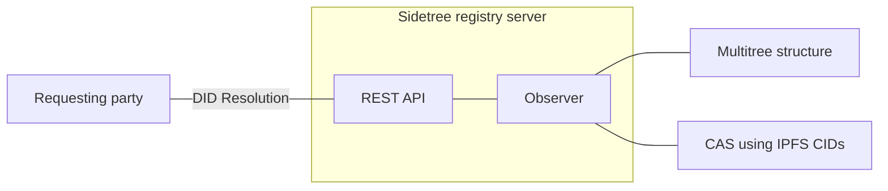
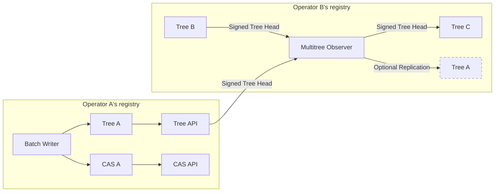
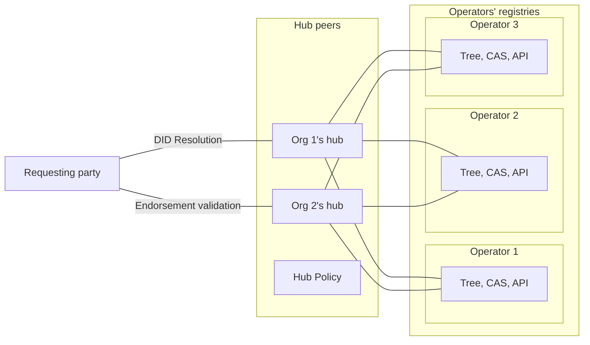

# Multitree: Federated Sidetree DID method

Status: concept whitepaper
Version: Dec 7, 2020

## Introduction

Multitree* is a [decentralized identifier](https://www.w3.org/TR/did-core/) (DID) method that enables trusted DID verification over a federation of DID publishers. The method is loosely modelled on the concept of a [Fediverse](https://en.wikipedia.org/wiki/Fediverse), where an operator of a verifiable registry can start with their own instance, and also be able to interconnect with other verifiable registry operators over time. DID controllers may migrate their DIDs over different DID publishers over time. We also introduce the concept of a Multitree Hub, where a group of DID observers/witnesses support resolution over multiple DID registry operators.

Multitree is designed to support interoperability across independent registries and be agnostic to implementation choices within these registries. Each independent operator can form their own "Multitree" registry and these registries can be interconnected. We use a data model that is independent of a protocol, database or DLT. In particular, we enable interconnected independent registries without up-front coordination nor a dependency on using the same registry implementation. These registries can independently form over time and then choose to interconnect.

* Note: we may need to consider other names if we want to avoid comparisons to [multiformats](https://multiformats.io).

## History and motivation

The Multitree DID method is an evolution of the TrustBloc DID method. The [TrustBloc DID](https://github.com/trustbloc/trustbloc-did-method/blob/master/docs/spec/trustbloc-did-method.md) method had the goal of bringing together a group of independent parties, a consortium, to share custody of a DID registry. The [DIF Sidetree protocol](https://identity.foundation/sidetree/spec/) was leveraged to minimize the needed trust in the ledger – each DID forms its own verifiable hash chain such that only the DID controller can provide proofs of changes.

To share custody, the TrustBloc DID method defined verifiable policies that defined the membership of these parties and registry policies such as cache time and the number of endorsements (witnesses) that a Requesting Party (RP) should receive in order to trust the registry results. The method enabled verification via a hash-chain of changes from a genesis point to the latest version. As there can be many such DID registry groups (consortiums), the DID method also defined mechanisms to discover each entity’s endpoints.

As we will discuss, this DID method shifts the role of the consortium to be witnesses of many independent DID registries (in the form of independent Sidetree-based registries). The witness role enables resolution across multiple "Multitree" registries (as defined in this document) with independent endorsement of the results. Each independent operator can form their own "Multitree" registry and these registries can be interconnected and witnessed.

## Federation structure

The following block diagrams demonstrate how Sidetree components are structured into a federated DID registry. Note: In this document, a "multitree structure" or "tree" is assumed to have the properties of a [Merkle Tree](https://en.wikipedia.org/wiki/Merkle_tree). Please review the [Sidetree protocol](https://identity.foundation/sidetree/spec/) components as background.

### Single instance

In the basic single instance, we have a structure that resembles a normal Sidetree deployment. This method will define concrete representations for the data structure to enable interconnections.

#### Publishing

#### Resolution

### Interconnected instances

In a basic interconnected instance, we have a structure where one operator observes operations from another operator and incorporates those operations into their own registry. The combined changes from multiple operators are represented in the registry using another Multitree structure. In this case, the signed tree heads from each observed operator are stored. 

The operator may also choose to replicate observed Trees and CAS of other operators. By enabling observation and replication, peer-to-peer [gossip protocol network](https://en.wikipedia.org/wiki/Gossip_protocol) can form. These interconnected instances enable greater dissemenation and redundancy of decentralized identifiers.

#### Tree monitoring

The following diagram illustrates two Operator organizations, where Operator B is also monitoring Operator A’s tree. In this case, Operator B also has a batch writer (not shown) that writes into "Tree B". The combined trees (represented as periodic signed tree heads) are stored into "Tree C".

In Sidetree, a particular unique suffix forms its own tree structure independent of the ledger. Each change (operation) to the original unique suffix references the previous which forms its own independent verifiable chain. For interconnected cases (as described above), we must also define rules for a unique suffix that has operations across multiple trees. These rules could, conceptually, either be based on existing Sidetree operations or by defining explicit operations.

To apply patches when observing multiple trees (without defining a new Sidetree operation), we need a rule to determine the currently active tree. The longest observed suffix chain forms the authoritative operation sequence for that suffix. 

However, it would seem sensible to have a more explicit operation for moving a DID across trees. This more explicit operation could be envisioned as a signed export/move operation for the old tree and a signed import variation of create for the new tree. An observer with knowledge of both trees would then be able to verify, in many cases, that the export and import are linked. Having export and import variations may also lessen the burden on the DID controller to preserve the suffix chain. Having explicit operations also more explicitly resolves the rules for a chain that has a deactivate operation versus another chain that continues with recovery operations.

Considerations:

* The operator that is observing another operator MAY replicate the tree and CAS into their own registry. To enable replication across registries, the trees should be storage-agnostic, protocol-agnostic, and transport-agnostic formats (and be offline-compatible).
* The usage of a verifiable tree structure between operators enable detection of attempts to change history or rollback. When these attempts occur, an operator can independently determine their appropriate response (e.g., alert, stop observing the other operator, and/or ignore the trees from that operator).
* The usage of signed tree heads provides additional assurance beyond transport security that an operator intended to publish their tree. Additional metadata is also included (e.g., the operator’s timestamp).
* It is not always possible to verify that export and import operations are linked. Exceptions occur when the old tree becomes decommissioned or, more generally, when the DID controller becomes unable to push their changes onto the old tree. In these cases, it would still be desirable that they could import into a new tree regardless of the old tree not containing the linked export.

##### Moving between trees using existing Sidetree operations

As a thought experiment, we could attempt to create rules to disambiguate suffix chain length without creating explicit operations. The suffix chain length is based on both the Sidetree recovery and update commitments as follows:

* A suffix chain with a valid deactivate operation wins. The DID is deactivated.
  * Note: This rule is present as the DID Controller showed their intent to deactivate in some known tree. However, it could be also be argued that the longest chain of recovery commitments always takes precedence.
* The longest chain of Sidetree recovery commitments wins.
* In case of a tie between two trees' suffix recovery chain length, the longest chain of update commitments wins.
* In case of a tie between two trees' suffix chain length with the same operations (no conflict), there is no issue.
* In the ambiguous case of a tie between two trees' suffix chain length with different final operations, the final ambiguous operation is ignored (and not applied). Note: to properly break the tie, the DID controller should apply an operation to one of the trees.

When moving a DID to a new tree (without defining a new Sidetree operation):

  * The controller MUST publish the existing creation and recovery sequences onto the new tree.
  * The controller MUST publish a new recovery operation onto the new tree (and not the old tree) with the latest document content.
  * Note: we should also signal that operations will no longer be on the old tree. However, the existing Sidetree deactivate operation semantics do not completely match the Multitree semantics (despite some similarity). An explicit export operation (as mentioned earlier) would be beneficial for this case.

### Hub instances

A hub instance provides a well-known location where many tree instances are interconnected. The hub also enables policy-driven witnesses such that multiple entities may, together, provide greater assurance about the current state of a DID document. With greater assurance, there is less need for each requesting party to run their own observer instances.

#### Single organization

When a single organization is running a hub, we have a structure that resembles the interconnected case above. An example of a single organization case is where the hub is acting as the resolver for that organization. In the diagram below, we show a single Hub organization that is monitoring Trees from different organizations.

A hub MAY also choose to host replicas of the trees being monitored. By maintaining its own replicas, the hub is able to independently track history, gain redundancy, and increase efficiency. 

When hub claims to act as a witness for a particular Tree, it is important that the hub understands the operator’s tree structure (and version) and the Sidetree parameters (and version) that are embedded within the tree. This tree and protocol parsing capability is needed so that they can provide endorsements of Tree (and Sidetree protocol) validity.

#### Multiple organizations

For cases where resolution trust should not be with a single organization, we also provide a structure to enable a consortium to run a Hub together. The consortium structure enables a policy-driven approach to [endorsement](https://hyperledger-fabric.readthedocs.io/en/release-2.2/policies/policies.html#chaincode-endorsement-policies) (witnesses) of the history of the Trees being observed.

The following diagram illustrates a case where the Hub policy requires two organizations to endorse/witness the history of the trees. The policy can be scaled as needed.

It is necessary for a logical Hub to have tighter coupling than the interconnected instance case described earlier. The Hub must enable peers to coordinate a common verifiable history and define a common policy to be applied and enforced. By coordinating a common verifiable history, we gain replicas of an auditable history across Hub organizations.

The multiple organization Hub case is an evolution of the TrustBloc DID, where consortium policy and discovery is defined on top of the [Sidetree REST API](https://identity.foundation/sidetree/api/). The Hub case in this document adds description for enabling multiple external trees to be observed.

## DID strings and resolution

The canonical representation for a DID string is:

did:<method name>:<tree version><tree id>:<unique suffix>

* Method Name: The DID method defined in this document (currently did:multitree).
* Unique Suffix: The unique suffix is defined by the Sidetree protocol specification.
* Tree version (/type): Enables signaling metadata about the Tree for Multitree processors. This field allows for potential system evolution (future-proofing), similar to [IPFS CIDs](https://docs.ipfs.io/concepts/content-addressing/) or [multiformats](https://multiformats.io).
* Tree ID: To mitigate against rollbacks, a tree identifier can be provided such that the resolution MUST fail if unique suffix chain does not include the tree. For greater clarity, this does not mean that the DID suffix is locked to that tree – the controller may continue the unique suffix chain onto another tree following the rules described above.
  * Note: the tree id needs more description based on the concrete implementation. The TrustBloc implementation currently includes a genesis configuration hash in this position. The Tree ID MUST be unique based on some verifiable genesis mechanism.
  * As mentioned earlier, a more explicit operation to move DIDs between trees is useful. In this case, there is some concern if the original tree disappears but the DID is still in use. An explicit operation could act as a checkpoint of the old tree identifier onto the new tree.

As will be discussed in the next section, the DID string MAY also include a discovery reference to assist with discovery of hubs or operators.

did:<method name>:<discovery reference>:<tree id>:<unique suffix>

Note: the resolver MUST also return the canonical DID string in the resolver metadata (without the discovery reference), as described above.

## Discovery

### Tree host discovery

The DID string MAY contain a discovery reference, as a hint to the resolver of the hubs or operators that currently host this unique suffix (and can verify the path from the referenced Tree). For multi-organization hubs, the hint SHOULD also include the genesis hash of the consortium configuration. The resolver MAY have its own policies on which hubs or operators can be used.

The concrete specification will provide schema and caching details.

### Well-Known

As with the TrustBloc DID method, a domain containing a Well-Known ([RFC 8615](https://tools.ietf.org/html/rfc8615)) configuration for the Multitree DID method MAY be used.

did:<method name>:<Well-Known domain>:<tree id>:<unique suffix>

### IPNS

When usage of domains is undesirable, a potential additional mechanism is to leverage [IPNS](https://docs.ipfs.io/concepts/ipns/) to hold configuration. It is expected that not all operators nor hubs will support IPNS discovery.

did:<method name>:<IPNS address>:<tree id>:<unique suffix>

In the above example, it is assumed that the IPNS segment is hosted on the global/default IPFS network. A potential consideration with IPNS is the ability to signal usage of the global IPFS network vs a private IPFS network. Another consideration is a capability similar to [DNSLink](https://docs.ipfs.io/concepts/dnslink/), where a domain provides a reference to IPNS. Both of these considerations may be applicable in the Well-Known configuration.

### Hub membership and policy discovery

The ability for discovery of hub membership and policy information is envisioned to be based on the TrustBloc DID method mechanisms. These mechanisms include:

* [Endpoint discovery](https://github.com/trustbloc/trustbloc-did-method/blob/master/docs/spec/trustbloc-did-method.md#endpoint-discovery)
* [Policy configuration](https://github.com/trustbloc/trustbloc-did-method/blob/master/docs/spec/trustbloc-did-method.md#consortium-policy-configuration)
* [Boostrapping trust](https://github.com/trustbloc/trustbloc-did-method/blob/master/docs/spec/trustbloc-did-method.md#bootstrapping-trust)
* [Configuration updates](https://github.com/trustbloc/trustbloc-did-method/blob/master/docs/spec/trustbloc-did-method.md#configuration-updates)

## Next steps

This initial concept document represents an introduction to the concepts behind the federated DID method. The DID method document is intended to contain both concrete APIs and representations rather than be an abstract framework like the Sidetree protocol.

### Method naming considerations

The "multitree" name could refer to the idea that there are multiple representations for the tree format OR that we are federating multiple trees OR both. In the context of [multiformats](https://multiformats.io), it is closer to the former.

### Concrete implementation considerations

The next step for this document is to list concrete representations and APIs. As a starting point, here are background implementations that may be applicable.

* CAS
  * IPFS/[IPLD](https://specs.ipld.io) CIDs and representations enable a common encoding for the CAS.
  * As demonstrated in the [Hyperledger Fabric dcas extension (at TrustBloc)](https://github.com/trustbloc/fabric-peer-ext/tree/master/pkg/collections/offledger/dcas), usage of these encodings does not imply usage of the IPFS network. Operators can expose a method-defined API that enables retrieval of documents based on CIDs.
* Verifiable and replicatable trees. Our goal is to use a data model that form its own layer - independent of a protocol or DLT (or vendor). The replicated trees should also work in an offline-compatible manner (see also [SSB](https://github.com/ssbc/ssb-server) as background).
  * [Google Trillian project](https://github.com/google/trillian) (supporting implementation of [Certificate Transparency](https://tools.ietf.org/html/rfc6962) and [Go module checksum database](https://go.googlesource.com/proposal/+/master/design/25530-sumdb.md)).
  * Potentially a [Git](https://git-scm.com)-based structure could also be a consideration, but there are benefits to using a more targeted approach.
* Multi-organization hubs
  * Hub organizations may choose to coordinate by anchoring observed tree heads and hub policy in a distributed ledger such as [Hyperledger Fabric](https://github.com/hyperledger/fabric).
  * The [TrustBloc DID method](https://github.com/trustbloc/trustbloc-did-method/) and [sidetree-fabric](https://github.com/trustbloc/sidetree-fabric) represent a starting point.
    * The TrustBloc DID method is envisioned to generalize into this common DID method specification. The consortium policy configuration should evolve into the hub policy and the genesis configuration hash concepts should be included in the discovery hints.
    * The sidetree-fabric implementation is envisioned to support the intermediate tree format and hub features.
* Registry protocols
  * Well-defined APIs to access Sidetree operations, DID resolution, Trees, and CAS. Uses existing Sidetree APIs, where they already exist.
  * Pull-based mechanism for observers to determine latest Tree heads.
    * An API to determine the latest tree head (see, for example, [certificate transparency API](https://tools.ietf.org/html/rfc6962#section-4.3)).
  * Protocol to dissemenate tree updates to subscribed observers, for enhanced immediacy and efficiency of updates.
    * [WebSub](https://www.w3.org/TR/websub/) provides a PubSub protocol that can provide notifications of new Tree heads.
    * [ActivityPub](https://www.w3.org/TR/activitypub/) is a protocol in Fediverse implementations for push-based activity notifications.
* Multitree registry implementation
  * An additional project, leveraging the existing [sidetree-core-go](https://github.com/trustbloc/sidetree-core-go), is envisioned to support the multitree instance features.
